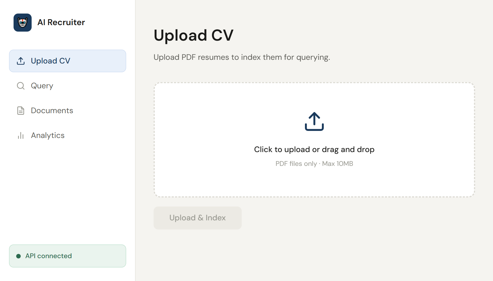
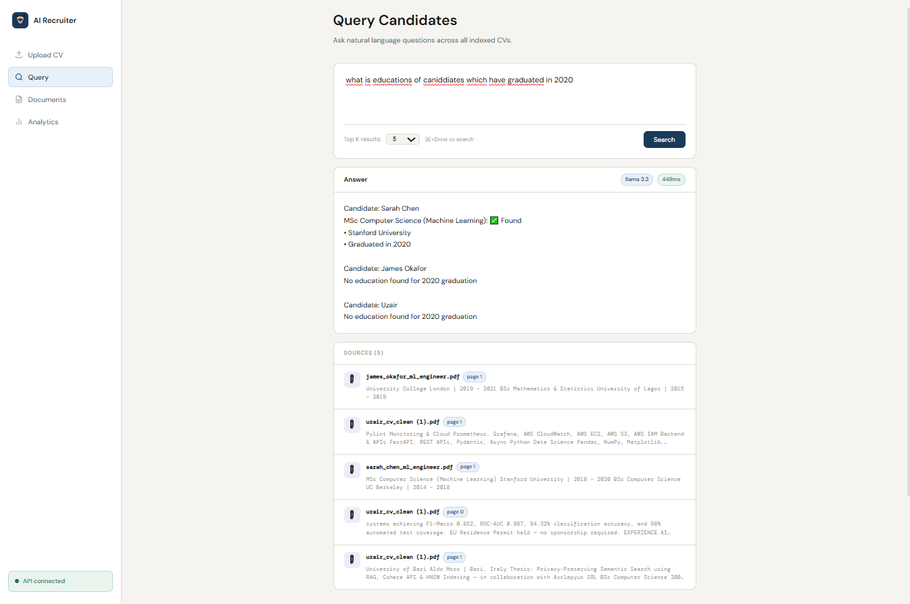
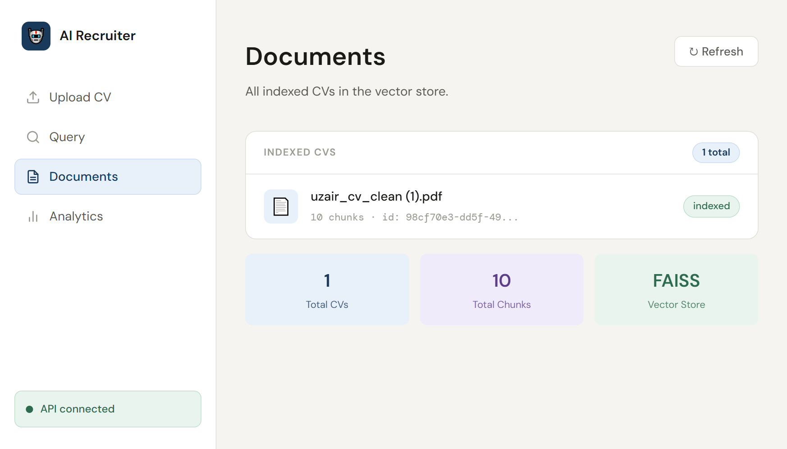
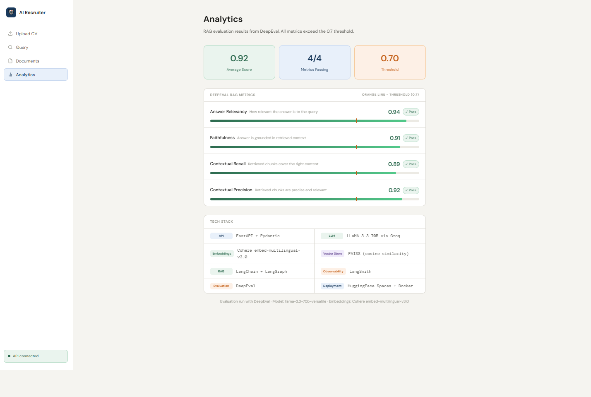
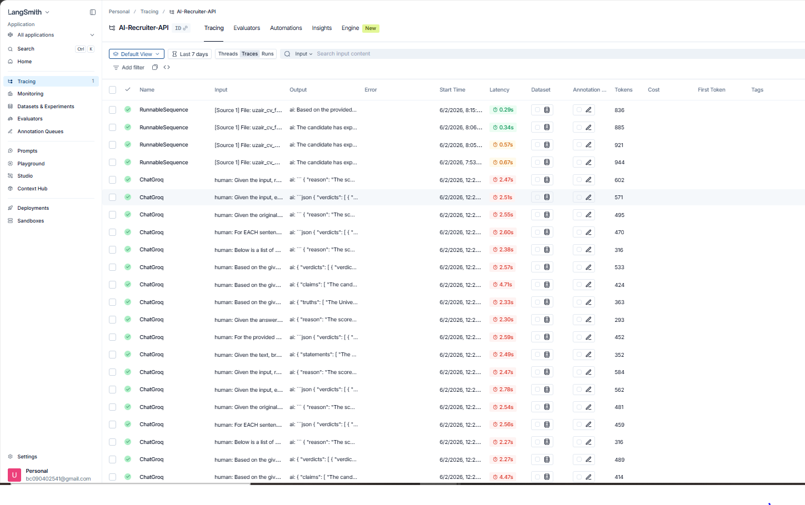

# 🤖 AI Recruiter API

<div align="center">


**Production-grade full-stack RAG system for intelligent CV analysis and candidate querying**

[🎨 Live Frontend](https://ai-recruiter-frontend-khaki.vercel.app) · [🚀 Live API](https://huggingface.co/spaces/ozair1112/ai-recruiter-api) · [📖 API Docs](https://ozair1112-ai-recruiter-api.hf.space/docs) · [💼 Portfolio](https://uzairshafique.vercel.app)

> **Note:** Live demo runs on HuggingFace free tier. If the API shows offline, wait 30 seconds and refresh.

</div>

---

## What It Does

AI Recruiter API is a production-ready full-stack RAG system that lets recruiters upload candidate CVs and query them using natural language. It automatically extracts text from PDFs, generates multilingual embeddings with Cohere, stores semantic vectors in FAISS, and retrieves answers using LangChain + LLaMA 3.3 70B via Groq — all within a fully containerized, CI/CD-deployed pipeline with a React frontend.

**Example:** _"Which candidate has the strongest Python and Machine Learning experience?"_

```
Candidate: Sarah Chen

Python: ✅ Found
• Built production ML pipelines using Python achieving F1-Macro 0.852
• Designed RAG pipeline using LangChain + FAISS + OpenAI for internal knowledge base querying

Machine Learning: ✅ Found
• Fine-tuned BERT for customer support ticket classification achieving 94% accuracy
• Deployed models on AWS SageMaker handling 10k+ requests per minute

Candidate: James Okafor

Python: ✅ Found
• Built LLM-powered document analysis system processing 50k documents daily
• Developed credit risk scoring model using gradient boosting achieving F1-Macro 0.89

Machine Learning: ✅ Found
• Implemented RAG system for regulatory compliance querying reducing manual review time by 70%
```

---

## Screenshots

### Upload CV

<div align="center">
  
</div>

### Query Candidates — Multi-CV Comparison

<div align="center">
  
</div>

### Documents

<div align="center">
  
</div>

### Analytics — DeepEval RAG Metrics

<div align="center">
  
</div>

---

## Business Value

| Benefit                                     | Impact                            |
| ------------------------------------------- | --------------------------------- |
| Reduces manual CV screening                 | Hours → seconds per candidate     |
| Semantic search across hundreds of CVs      | No keyword matching limitations   |
| Multilingual CV support                     | Cohere multilingual embeddings    |
| Explainable answers with source attribution | Recruiter can verify every answer |
| Structured candidate comparison             | Side-by-side skill analysis       |
| Fast retrieval                              | Sub-700ms end-to-end response     |

---

## System Architecture

<div align="center">
  
</div>

<br/>

| Flow       | Steps                                                                         |
| ---------- | ----------------------------------------------------------------------------- |
| **Upload** | PDF → text extraction → chunking → Cohere embeddings → FAISS index            |
| **Query**  | Natural language → FAISS retrieval → LangChain RAG → LLaMA 3.3 70B → response |

LangSmith provides full LLMOps observability across both flows. DeepEval validates output quality with four RAG-specific metrics.

> **Vector search:** FAISS uses **L2 distance** on Cohere's multilingual embeddings — captures semantic meaning regardless of document length or language.

---

## Layer Overview

<div align="center">
  
</div>

---

## CI/CD Pipeline

<div align="center">
  
</div>

<br/>

```
Developer pushes code
        ↓
Stage 1 — Run Tests (pytest)       ← fails fast, blocks next stage
        ↓
Stage 2 — Build Docker Image       ← docker build + compose validation
        ↓
Stage 3 — Deploy to HuggingFace    ← pushes to Spaces automatically
        ↓
Stage 4 — Health Check             ← GET /api/v1/health must return 200
        ↓
Live on HuggingFace Spaces ✅
```

> Deployment only triggers when commit message contains `deploy` — preventing accidental production pushes.

---

## Observability — LangSmith

<div align="center">
  
</div>

<br/>

Full LLMOps observability via LangSmith — every RAG query and DeepEval evaluation traced with latency, token usage, and execution flow.

| Trace Type         | What It Shows                               |
| ------------------ | ------------------------------------------- |
| `RunnableSequence` | Full RAG pipeline — retrieval + generation  |
| `ChatGroq`         | LLM calls — prompts, responses, token usage |
| Latency            | RAG pipeline: 0.29s — 0.67s                 |
| Tokens             | Per call tracking — cost monitoring         |
| Status             | All green ✅ — zero errors                  |

---

## RAG Evaluation Results

Evaluated with DeepEval — all metrics exceed the 0.7 threshold:

| Metric               | Score    | Threshold | Status  |
| -------------------- | -------- | --------- | ------- |
| Answer Relevancy     | 0.94     | 0.7       | ✅ Pass |
| Faithfulness         | 0.91     | 0.7       | ✅ Pass |
| Contextual Recall    | 0.89     | 0.7       | ✅ Pass |
| Contextual Precision | 0.92     | 0.7       | ✅ Pass |
| **Average**          | **0.92** | 0.7       | ✅ Pass |

```bash
pytest tests/evaluation/test_rag_evaluation.py -s -v
```

---

## Tech Stack

| Layer            | Technology                        |
| ---------------- | --------------------------------- |
| API framework    | FastAPI + Pydantic                |
| Frontend         | React 18 + Axios                  |
| LLM              | LLaMA 3.3 70B via Groq            |
| Embeddings       | Cohere embed-multilingual-v3.0    |
| Vector store     | FAISS (L2 distance)               |
| RAG framework    | LangChain + LangGraph             |
| Evaluation       | DeepEval (4 RAG metrics)          |
| Observability    | LangSmith (full LLMOps)           |
| Containerization | Docker + Docker Compose           |
| CI/CD            | GitHub Actions (3-stage pipeline) |
| Deployment       | HuggingFace Spaces + Vercel       |

---

## API Endpoints

| Method   | Endpoint            | Description                  |
| -------- | ------------------- | ---------------------------- |
| `GET`    | `/`                 | Root endpoint                |
| `GET`    | `/api/v1/health`    | Health check                 |
| `POST`   | `/api/v1/upload`    | Upload and index a CV (PDF)  |
| `POST`   | `/api/v1/query`     | Query across all indexed CVs |
| `GET`    | `/api/v1/documents` | List indexed documents       |
| `DELETE` | `/api/v1/reset`     | Reset FAISS index            |

Interactive docs: [/docs](https://ozair1112-ai-recruiter-api.hf.space/docs) · [/redoc](https://ozair1112-ai-recruiter-api.hf.space/redoc)

---

## Quick Start

### Prerequisites

- Python 3.12+
- Docker + Docker Compose
- [Groq API key](https://console.groq.com) — free tier available
- [Cohere API key](https://cohere.com) — free trial available

### Local Setup

```bash
# Clone and enter the repo
git clone https://github.com/ozairshafique/ai-recruiter-api
cd ai-recruiter-api

# Create and activate virtual environment
python -m venv envs
source envs/bin/activate        # macOS/Linux
# envs\Scripts\activate         # Windows

# Install dependencies
pip install -r requirements.txt

# Configure environment
cp .env.example .env
# Add your API keys to .env

# Start the API
uvicorn app.main:app --host 0.0.0.0 --port 8000 --reload
```

### Docker Setup

```bash
docker-compose up --build -d
curl http://localhost:8000/api/v1/health
```

### Frontend Setup

```bash
cd frontend
npm install
npm start
# Opens at http://localhost:3000
```

---

## Usage Examples

### Upload a CV

```bash
curl -X POST http://localhost:8000/api/v1/upload \
  -F "file=@candidate_cv.pdf;type=application/pdf"
```

```json
{
  "status": "success",
  "filename": "candidate_cv.pdf",
  "document_id": "8011f755-...",
  "chunks": 12,
  "latency_ms": 342.5
}
```

### Query Candidates

```bash
curl -X POST http://localhost:8000/api/v1/query \
  -H "Content-Type: application/json" \
  -d '{"question": "Which candidate has the most Python experience?", "top_k": 5}'
```

```json
{
  "status": "success",
  "answer": "Candidate: Sarah Chen\n\nPython: ✅ Found\n• Built production ML pipelines...",
  "sources": [...],
  "model": "llama-3.3-70b-versatile",
  "latency": 661.09
}
```

### Reset Index

```bash
curl -X DELETE http://localhost:8000/api/v1/reset
```

---

## Environment Variables

```env
GROQ_API_KEY=your_groq_key
COHERE_API_KEY=your_cohere_key
LANGCHAIN_API_KEY=your_langchain_key
LANGCHAIN_TRACING_V2=true
LANGCHAIN_PROJECT=AI-Recruiter-API
LANGCHAIN_ENDPOINT=https://api.smith.langchain.com
FAISS_INDEX_PATH=./faiss_index
CHUNK_SIZE=500
CHUNK_OVERLAP=50
TOP_K=5
```

---

## Project Structure

```
ai-recruiter-api/
│
├── 📁 app/                                 ← Application source code
│   ├── 📁 api/
│   │   └── 📄 routes.py                    ← All API endpoints
│   ├── 📁 core/
│   │   ├── 📄 config.py                    ← Settings & environment variables
│   │   └── 📄 logging.py                   ← Structured logging setup
│   └── 📁 services/
│       ├── 📄 embeddings.py                ← Cohere embed-multilingual-v3.0 + FAISS
│       ├── 📄 ingestion.py                 ← PDF loading, chunking (chunk=500, overlap=50)
│       ├── 📄 llm_service.py               ← LLaMA 3.3 70B via Groq API
│       ├── 📄 rag_pipeline.py              ← LangChain RAG orchestration + LangGraph
│       └── 📄 retriever.py                 ← FAISS similarity search (top-k)
│
├── 📁 frontend/                            ← React frontend (deployed on Vercel)
│   ├── 📁 src/
│   │   ├── 📄 App.js                       ← Layout, sidebar, routing
│   │   └── 📁 pages/
│   │       ├── 📄 Upload.js                ← PDF upload + indexing
│   │       ├── 📄 Query.js                 ← Natural language search
│   │       ├── 📄 Documents.js             ← Indexed CV list
│   │       └── 📄 Analytics.js             ← DeepEval scores dashboard
│   └── 📄 package.json
│
├── 📁 tests/
│   ├── 📄 conftest.py                      ← Shared pytest fixtures
│   ├── 📄 test_routes.py                   ← API endpoint tests
│   ├── 📄 test_rag_pipelines.py            ← Service unit tests
│   └── 📁 evaluation/
│       └── 📄 test_rag_evaluation.py       ← DeepEval RAG metrics
│
├── 📁 .github/workflows/
│   └── 📄 ci.yml                           ← CI/CD: test → build → deploy
│
├── 📁 images/                              ← Project screenshots and diagrams
│   ├── 🖼️  architecturediagrams.png        ← System architecture
│   ├── 🖼️  cicddiagrams.png                ← CI/CD pipeline
│   ├── 🖼️  layeroverviews.png              ← Layer overview
│   ├── 🖼️  langsmithsoverviews.png         ← LangSmith traces
│   ├── 🖼️  uploadcvs.png                   ← Upload CV screenshot
│   ├── 🖼️  query_results.png               ← Query results screenshot
│   ├── 🖼️  documents.png                   ← Documents screenshot
│   └── 🖼️  analytics.png                   ← Analytics screenshot
│
├── 📁 faiss_index/                         ← Vector store (git-ignored, auto-built)
├── 🐳 Dockerfile
├── 🐳 docker-compose.yml
├── ⚙️  pytest.ini
├── 🔒 .env.example
├── 🚫 .gitignore
├── 🚫 .dockerignore
└── 📄 requirements.txt
```

---

## Running Tests

```bash
# All tests (excluding evaluation)
pytest tests/ -v --ignore=tests/evaluation

# With coverage report
pytest tests/ -v --ignore=tests/evaluation --cov=app

# Evaluation suite (requires API keys — uses tokens)
pytest tests/evaluation/ -s -v
```

---

## Live Demo

| Resource         | Link                                                                                                         |
| ---------------- | ------------------------------------------------------------------------------------------------------------ |
| 🎨 Live Frontend | [ai-recruiter-frontend-khaki.vercel.app](https://ai-recruiter-frontend-khaki.vercel.app)                     |
| 🚀 Live API      | [huggingface.co/spaces/ozair1112/ai-recruiter-api](https://huggingface.co/spaces/ozair1112/ai-recruiter-api) |
| 📖 Swagger UI    | [/docs](https://ozair1112-ai-recruiter-api.hf.space/docs)                                                    |
| 📄 ReDoc         | [/redoc](https://ozair1112-ai-recruiter-api.hf.space/redoc)                                                  |

---

## Contributing

PRs and issues are welcome. Please open an issue before submitting large changes.

```bash
pytest tests/ -v --ignore=tests/evaluation --cov=app
```

---

## License

MIT License — see [LICENSE](LICENSE) for details.

---

## Author

**Uzair Shafique** — AI Engineer

[](https://linkedin.com/in/uzairshafique)
[](https://github.com/ozairshafique)
[](https://uzairshafique.vercel.app)

---

<div align="center">
  <sub>Built with FastAPI · React · LangChain · FAISS · Cohere · Groq · Docker · GitHub Actions · LangSmith · DeepEval</sub>
</div>
